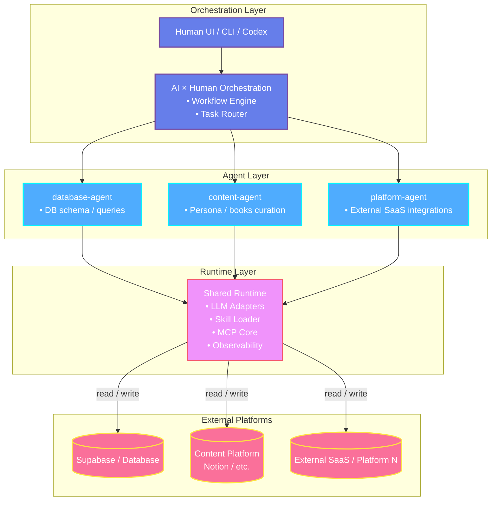
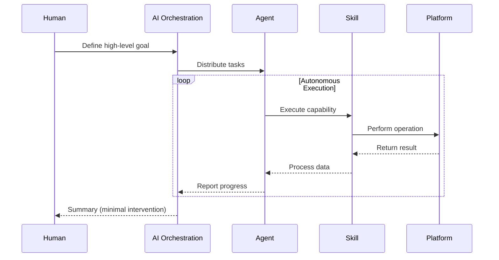

# AAO Skeleton

**Autonomous Agent Organization (AAO)** is a minimal architecture template for building autonomous AI systems that coordinate tasks across multiple platforms with reduced human involvement.

This skeleton provides a **type-safe, extensible foundation** for creating domain-specific agents that operate independently while sharing common runtime infrastructure.

## Core Concepts

### Agents
Independent TypeScript projects that encapsulate platform-specific operations. Each agent is fully isolated with its own dependencies, environment, and documentation.

### Skills
Reusable, composable units of functionality packaged with metadata (`skill.yaml`), implementation, and tests. Skills are dynamically loaded by the runtime.

### MCP (Model Context Protocol)
Standard interface between agents and external platforms, providing secure, sandboxed tool execution.

### Orchestration
AI-driven coordination layer that manages high-level planning, task distribution, and minimal human touchpoints.

### Shared Runtime
Common infrastructure providing multi-LLM support, skill loading, observability, and MCP execution.

## Architecture Overview



## System Flow



## Directory Structure

```
aao-skeleton/
│
├── orchestration/                 # AI×Human coordination layer
│   ├── plans/                    # Strategic playbooks
│   ├── flows/                    # Automated workflows
│   └── cli/                      # Command interfaces
│
├── agents/                        # Your domain-specific agents
│   ├── {agent-name}/             # Replace with your agents
│   │   ├── index.ts              # Agent implementation
│   │   ├── INSTRUCTIONS.md       # Domain rules & guidelines
│   │   ├── tools/
│   │   │   ├── skills/           # Agent-specific capabilities
│   │   │   └── mcp/              # Platform connectors
│   │   └── docs/                 # Agent documentation
│   │
│   └── .../                      # Add more agents as needed
│
├── packages/
│   └── agent-runtime/             # Shared infrastructure
│       ├── adapters/              # LLM providers (OpenAI, Anthropic, Local)
│       ├── mcp/                   # MCP client & sandbox
│       ├── skill-loader/          # Dynamic capability loading
│       └── observability/         # Logging & tracing
│
└── docs/                          # System-level documentation
    ├── ARCHITECTURE.md
    ├── POLICIES.md
    └── RUNBOOKS.md
```

### Agent Template Structure

Each agent follows this canonical pattern:

```
{agent-name}/
├── index.ts                       # Entry point
├── INSTRUCTIONS.md                # Agent-specific rules
├── package.json                   # Dependencies
├── tsconfig.json                  # TypeScript config
├── tools/
│   ├── skills/                    # Capabilities
│   │   └── {skill-name}/
│   │       ├── skill.yaml         # Skill metadata
│   │       ├── src/               # Implementation
│   │       ├── tests/             # Test suite
│   │       └── templates/         # Resources
│   └── mcp/                       # Platform integration
└── .workspace/                    # Runtime workspace (gitignored)
```

## Design Philosophy

| Principle | Implementation |
|-----------|----------------|
| **Type-First** | Fixed canonical structure ensures consistency |
| **Platform Isolation** | One agent per platform, fully independent |
| **AI Autonomy** | Minimal human intervention, maximum automation |
| **Model Agnostic** | Support for multiple LLM providers |
| **Operations-First** | Documentation and policies as first-class citizens |
| **Extensibility** | Skeleton structure, custom implementation |

## Getting Started

This is a **template repository**. To build your autonomous system:

### 1. Clone the Skeleton
```bash
git clone <this-repo> your-project
cd your-project
```

### 2. Define Your Agents
Replace sample agents with your domain-specific implementations:
```bash
# Example: Create a CRM agent
cp -r agents/sample-agent agents/crm-agent
# Implement your CRM logic in agents/crm-agent/index.ts
```

### 3. Implement Skills
Create reusable capabilities for your agents:
```yaml
# agents/{your-agent}/tools/skills/{skill}/skill.yaml
name: your-skill
version: 0.0.1
entry: dist/index.js
```

### 4. Configure Orchestration
Define your automation playbooks:
```bash
# orchestration/plans/daily-operations.yaml
# orchestration/flows/data-pipeline.yaml
```

### 5. Set Environment
```bash
cp .env.example .env
# Add your API keys and configuration
```

## Technology Stack

- **Language**: TypeScript (ES2020, NodeNext modules)
- **Runtime**: Node.js
- **Package Manager**: pnpm (monorepo workspace)
- **LLM Support**: OpenAI, Anthropic, Local models
- **Protocol**: MCP (Model Context Protocol)
- **Architecture**: Skill-based, event-driven

## Sample Agents Included

This skeleton includes example agent structures to demonstrate the pattern:

- **supabase-agent**: Database operations example
- **note-agent**: Content management example
- **obsidian-agent**: Knowledge base example
- **x-agent**: Social platform example

Replace these with your own domain-specific agents based on your needs.

## Key Benefits

- **Complete Platform Isolation** - Each agent operates independently
- **Multi-LLM Provider Support** - Future-proof architecture
- **Type-Safe Operations** - Full TypeScript with strict mode
- **Reusable Skills** - Build once, use across agents
- **AI-First Orchestration** - Autonomous operation by default
- **Production Ready Structure** - Observability and policies built-in

## Documentation

- [`docs/ARCHITECTURE.md`](docs/ARCHITECTURE.md) - System design details
- [`docs/POLICIES.md`](docs/POLICIES.md) - Operational policies
- [`docs/RUNBOOKS.md`](docs/RUNBOOKS.md) - Deployment & maintenance
- [`AGENTS.md`](AGENTS.md) - Agent implementation guide

## Contributing

This is a template repository designed for downstream implementations. Fork or copy this skeleton to build your own autonomous system.

## License

MIT
