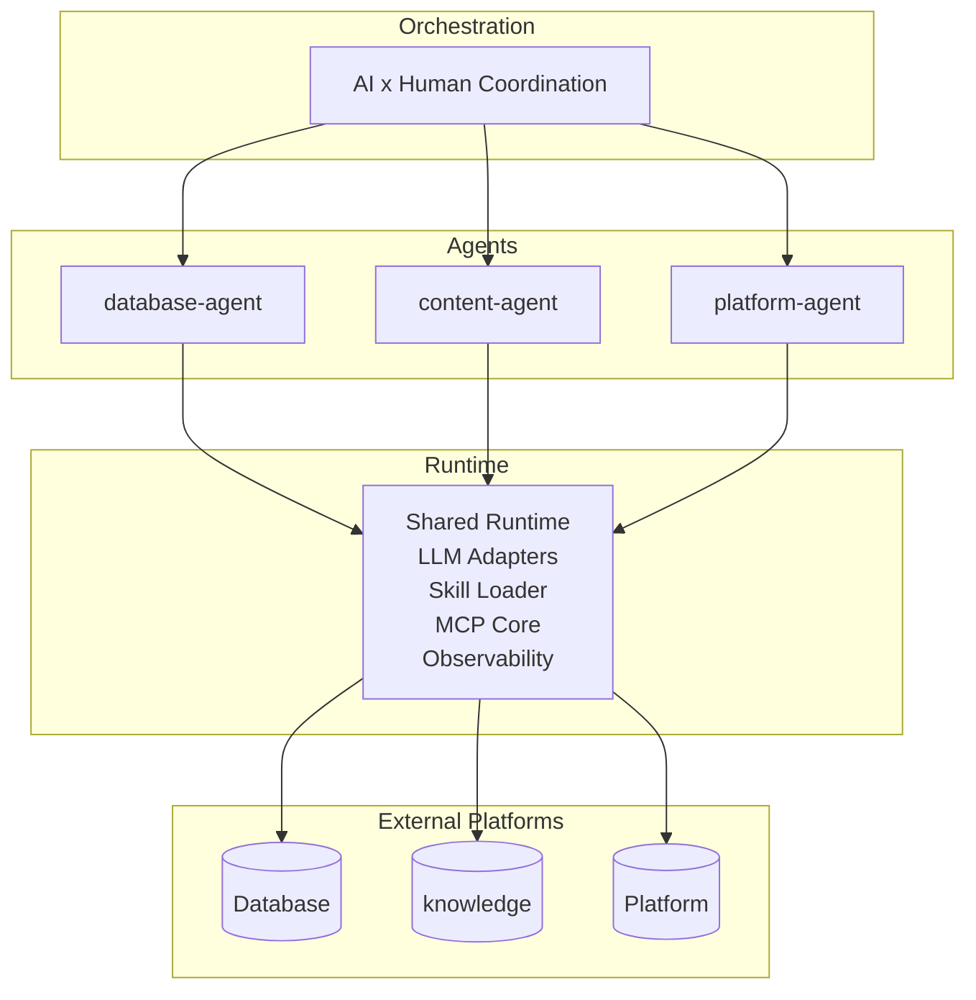

# AAO Skeleton

Autonomous Agent Organization (AAO) is a public skeleton for building autonomous, multi-agent systems with minimal human intervention. It keeps agents isolated, skills reusable, and orchestration visible.

## Why this skeleton
- Standardized agent layout so every platform integration looks the same.
- Shared runtime for MCP, LLM adapters, and skill loading.
- Clear separation between orchestration, agents, shared packages, and tooling.
- Documentation-first: policies, runbooks, and playbooks live next to the code.
- Open and composable - add or remove agents without touching the rest.

## Architecture (high level)



## Top-level layout

```
/
|- README.md
|- AGENTS.md                  # Global agent rules
|- package.json
|- pnpm-workspace.yaml
|- agents/                    # One folder per agent (Supabase, note, GitHub, etc.)
|- orchestration/             # Plans, flows, contracts, thin CLI entrypoints
|- packages/                  # Shared libraries (agent-runtime)
|- tooling/                   # Common CLI, scaffolding, templates
|- docs/                      # Architecture, policies, runbooks
|- infra/                     # Shared infra (placeholder)
`- .github/                   # CI/CD
```

## Agent standard layout

```
agents/<agent-id>/
  AGENTS.md
  README.md

  src/                         # Agent logic (entry: src/index.ts)
    lib/                       # Shared helpers for this agent

  skills/                      # MCP skills
    <skill-id>/
      skill.yaml
      README.md
      INSTRUCTIONS.md
      src/
      scripts/
      tests/
      templates/
      tsconfig.json

  mcp/                         # MCP client/sandbox/servers
    client/
    sandbox/
    servers/

  config/                      # Agent-scoped configs (ingestion, affiliates, rules)
  infra/                       # Agent infra (e.g., db migrations/scripts)
  data/                        # Agent data (samples, personas, etc.)
  generated/                   # Gitignored outputs (types, built skills)
    skills/
  tests/
    fixtures/
  docs/

  .workspace/                  # Runtime scratch (gitignored)
  .logs/                       # Agent logs (gitignored)
  .env.example
  .env
```

## Included agents (examples)
- **supabase-agent**: Database operations with `infra/db/` migrations and generated Supabase types under `generated/`.
- **note-agent**: Content and persona management; personas now live in `data/personas/`.
- **github-agent**: Git/GitHub workflows; shared utility in `src/lib/git-core.ts` with skills under `skills/gh-*`.
- **obsidian-agent**: Knowledge base skeleton; skills live under `skills/obsidian-vault/`.
- **x-agent**: Social platform placeholder with a minimal `skills/x-api/`.

Swap these with your own agents while keeping the layout.

## Shared packages
- `packages/agent-runtime/`: MCP client, sandbox, skill loader, observability, and LLM adapters.
- Future slots: `mcp-runtime/`, `shared-config/` (add when needed).

## Tooling and orchestration
- `tooling/cli`: Thin, shareable CLI entrypoints (`create-skill`, `skill-manager`, `push-pr`, `skill-postbuild`).
- `tooling/templates`: Seed files for new skills and agents.
- `orchestration/plans`: Playbooks (see `PLAN_TEMPLATE.md` and `directory-restructure.md`).
- `orchestration/flows`: Executable flows (example: `db-weekly.yaml`).
- `orchestration/contracts`: Schemas and contracts for cross-agent work.
- `orchestration/cli`: Human/AI-facing scripts that should delegate into `tooling/cli`.

## Getting started
1. **Clone** the skeleton and set up your workspace.
2. **Fork an agent**: copy an existing agent folder, rename it, and implement `src/index.ts`.
3. **Add skills**: scaffold from `tooling/templates/skill` into `agents/<agent>/skills/<skill>/` and fill in `skill.yaml` and `src/`.
4. **Wire MCP**: extend `agents/<agent>/mcp/servers/` for your platform and reuse `packages/agent-runtime`.
5. **Plan orchestration**: add a plan under `orchestration/plans/` and a flow under `orchestration/flows/`, then expose a thin script in `orchestration/cli/`.
6. **Configure env (two-layer)**:
   - Copy root `.env.example` to `.env` for shared defaults (LLM keys, logging, runtime endpoints).
   - Copy each `agents/<agent>/.env.example` to `agents/<agent>/.env` for agent-specific overrides (e.g., GitHub token, Supabase keys).
   - Load order: root `.env` then agent `.env` (agent wins on conflicts). Keep generated artifacts inside `generated/` or `packages/*/build/`.

## Documentation
- `docs/ARCHITECTURE.md` - System design
- `docs/POLICIES.md` - Operational policies
- `docs/RUNBOOKS.md` - Deployment and maintenance guides
- `docs/AGENTS.md` - Agent handbook
- `AGENTS.md` - Workspace agent contract

## License
MIT
