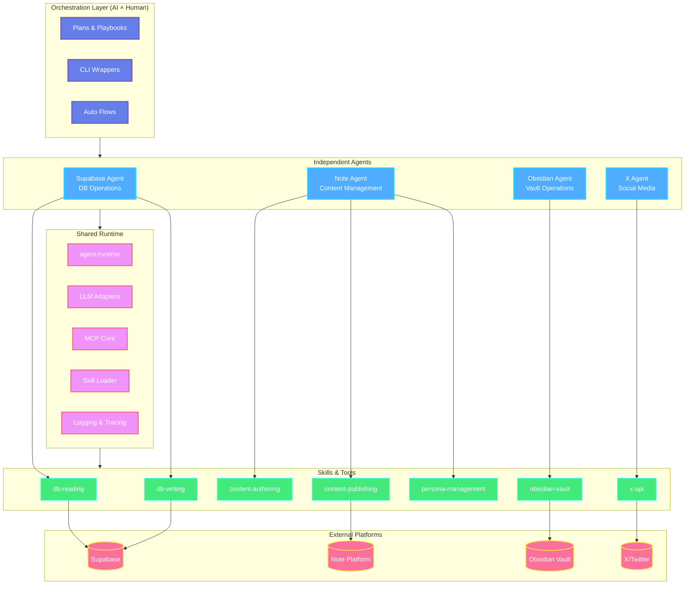

# AAO Skeleton

**Agent-Oriented Operations (AAO)** is an architecture template for building **AI-driven autonomous systems** that minimize human intervention.

This skeleton defines a fixed "type" — a canonical structure optimized for operation, evolution, safety, and reusability. Independent agents for each platform (Supabase, Note, Obsidian, X) work under an orchestration layer (AI × Human), enabling the entire operation to run autonomously.

## Architecture



## System Flow


## Directory Structure

```
aao-skeleton/
│
├── orchestration/             # AI×Human orchestration layer
│   ├── plans/                 # Long/short-term playbooks
│   ├── cli/                   # Command wrappers
│   └── flows/                 # Auto-orchestration definitions
│
├── agents/                    # Independent agent projects
│   ├── supabase-agent/        # Database operations
│   │   ├── index.ts
│   │   ├── db/{schemas,migrations,scripts}/
│   │   └── tools/skills/{db-reading,db-writing}/
│   │
│   ├── note-agent/            # Content management
│   │   ├── personas/          # Persona-based content
│   │   └── tools/skills/{content-authoring,publishing,persona-management}/
│   │
│   ├── obsidian-agent/        # Vault operations
│   │   └── tools/skills/obsidian-vault/
│   │
│   └── x-agent/               # Social media operations
│       └── tools/skills/x-api/
│
├── packages/
│   └── agent-runtime/         # Shared runtime & adapters
│       ├── adapters/          # OpenAI / Anthropic / Local
│       ├── mcp/               # MCP client & sandbox
│       ├── skill-loader/      # Dynamic skill loading
│       └── observability/     # Logging & tracing
│
└── docs/                      # Org-level documentation
    ├── ARCHITECTURE.md
    ├── POLICIES.md
    └── RUNBOOKS.md
```

## Core Concepts

### Agents
Each platform gets an **isolated TypeScript project** with its own dependencies, environment, documentation, and workspace. Agents operate independently and can be developed, tested, and deployed separately.

### Skills
Capabilities are defined via `skill.yaml`, packaged with scripts, templates, and tests. Skills are **reusable, composable, and testable** units of functionality loaded dynamically by the runtime.

### MCP (Model Context Protocol)
Agents interact with external platforms through **MCP servers**. Each agent has sandboxed MCP tools under `tools/mcp/{client,sandbox,servers}`.

### Orchestration
The **AI + Human orchestration layer** manages high-level planning and coordination. Model upgrades and policy changes affect only adapters and plans, not agent implementations.

### Shared Runtime
`packages/agent-runtime` provides:
- **Multi-LLM support**: OpenAI, Anthropic, Local models
- **MCP infrastructure**: Client, sandbox, server adapters
- **Skill loading**: Dynamic capability injection
- **Observability**: Structured logging and tracing

## Design Philosophy

| Principle | Implementation |
|-----------|----------------|
| **Type-first** | Fixed structure defines the system "type" |
| **Platform isolation** | 1 platform = 1 agent = 1 independent project |
| **AI autonomy** | Minimal human intervention, maximum AI-driven execution |
| **Model agnostic** | Adapters support multiple LLM providers |
| **Operations-first** | Docs, policies, runbooks are first-class citizens |
| **Skeleton over implementation** | This repo provides structure; downstream adds logic |

## Agent Structure

Each agent follows this canonical layout:

```
<agent-name>/
├── index.ts                   # Agent entrypoint
├── INSTRUCTIONS.md            # Domain-specific rules
├── package.json / tsconfig.json
├── .env / .env.example
├── docs/                      # Agent-specific docs
├── tools/
│   ├── skills/                # Skill packages
│   │   └── <skill>/
│   │       ├── skill.yaml
│   │       ├── src/
│   │       ├── scripts/
│   │       └── tests/
│   └── mcp/
│       ├── client/
│       ├── sandbox/
│       └── servers/<platform>/
└── .workspace/                # Gitignored scratch & logs
```

## Getting Started

This is a **template repository**. To use:

1. **Copy** this skeleton to your project repository
2. **Implement** business logic in agent `index.ts` files
3. **Define** skills in `tools/skills/` directories
4. **Configure** MCP servers for platform integrations
5. **Set up** orchestration plans in `orchestration/plans/`

The skeleton provides the structure; you provide the implementation.

## Technology Stack

- **Language**: TypeScript (ES2020, NodeNext)
- **Runtime**: Node.js
- **Package Manager**: pnpm (monorepo support)
- **LLM Providers**: OpenAI, Anthropic, Local models
- **Protocol**: MCP (Model Context Protocol)

## Key Features

- **Platform-first isolation** — Each agent is self-contained
- **Multi-LLM support** — Future-proof adapter architecture
- **Skill-based composition** — Reusable, testable capabilities
- **AI-driven orchestration** — Minimal human intervention
- **Type-safe operations** — TypeScript throughout
- **Sandbox execution** — Secure MCP tool isolation
- **Operations visibility** — Docs and policies built-in

## License

MIT
